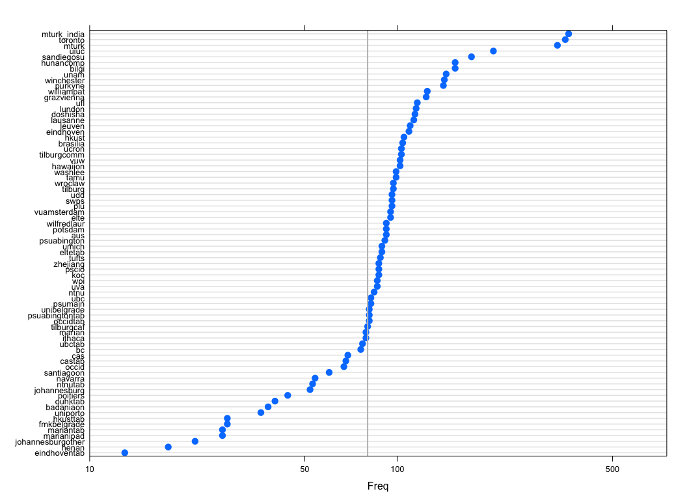
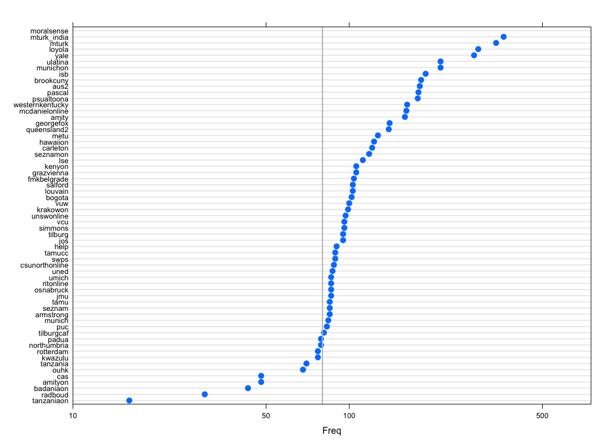

# ManyLabs2 Data Cleaning
[ManyLabs2](https://osf.io/8cd4r) (Corresponding coder: [Fred Hasselman](https://osf.io/ujgs6/))  
24 October 2015  


--------

* [To Code Review Instructions](https://ManyLabsOpenScience.github.io/ML2_RcodeReview.html)
* [To PoPS Proposal](https://ManyLabsOpenScience.github.io/ML2_PoPS_proposal.html)
* [To Data Cleaning Report (this page)](https://ManyLabsOpenScience.github.io/ML2_data_cleaning.html)
* [To Analysis-Specific Variable Functions](https://ManyLabsOpenScience.github.io/ML2_varfuns.html)

--------

# About this document


This document notes any general and site-specific exclusions or changes of values together with the rationale for doing so (for instance, changes due to a typo or mistranslation that was noticed and corrected for the script deployed at a particular site). 

These changes are implemented as specific filters, but affect only a small proportion of the overall participants. The changes are recorded at each step and are reported at the end of this document.

# Overall exclusion criteria that may not be noted elsewhere 

## **Exclude** responses that were incomplete. {.tabset .tabset-fade .tabset-pills}   
    
### **Explanation**

* Cases will be removed by applying a filter which selects only cases for which `Finished == 1` is true, where `Finished` is a variable present in each raw data set.

### **Implementation**      
The function `get.CSVdata(... , finishedOnly = TRUE)` merges each raw data file (comma seperated files available [here]()) into a data file per slate. It removes any incomplete cases as described above if `finishedOnly = TRUE`.    


```r
# MERGE RAW DATA ----------------------------------------------------------

# Set the working directory to where the raw data files are...
dataDir  <-  '~/Dropbox/Manylabs2/Raw Data'
fileList <- list.files(dataDir,".csv")

# Merge Slate 1 & remove incomplete cases
ML2.files.S1 <- fileList[grepl("Slate[_]*1", fileList)]
names(ML2.files.S1) <- ML2.files.S1
ML2.S1 <- tbl_df(ldply(.data = ML2.files.S1, .fun = get.CSVdata, path = dataDir, .inform = TRUE))

# Merge Slate 2 & remove incomplete cases
ML2.files.S2 <- fileList[grepl("Slate[_]*2", fileList)]
names(ML2.files.S2) <- ML2.files.S2
ML2.S2 <- tbl_df(ldply(.data = ML2.files.S2, .fun = get.CSVdata, path = dataDir, .inform = TRUE))

# Change the different date formtas to %Y=%m-%d
tmp     <- unlist(strsplit(c(ML2.S1$StartDate),"\\s"))
datemix <- tmp[seq(1,length(tmp),by=2)]
ML2.S1$StartDate <- gsub("-","/",datemix)
formats <- unique(ldply(unique(ML2.S1$StartDate),guess_datetime_format))
ML2.S1$StartDate  <- lubridate::parse_date_time(as.character(ML2.S1$StartDate), orders=gsub("e","a",formats$V1))

tmp     <- unlist(strsplit(c(ML2.S2$StartDate),"\\s"))
datemix <- tmp[seq(1,length(tmp),by=2)]
ML2.S2$StartDate <- gsub("-","/",datemix)
formats <- unique(ldply(unique(ML2.S2$StartDate),guess_datetime_format))
ML2.S2$StartDate  <- lubridate::parse_date_time(as.character(ML2.S2$StartDate), orders=gsub("e","a",formats$V1))

tmp     <- unlist(strsplit(c(ML2.S1$EndDate),"\\s"))
datemix <- tmp[seq(1,length(tmp),by=2)]
ML2.S1$EndDate <- gsub("-","/",datemix)
formats <- unique(ldply(unique(ML2.S1$EndDate),guess_datetime_format))
ML2.S1$EndDate  <- lubridate::parse_date_time(as.character(ML2.S1$EndDate), orders=gsub("e","a",formats$V1))


tmp     <- unlist(strsplit(c(ML2.S2$EndDate),"\\s"))
datemix <- tmp[seq(1,length(tmp),by=2)]
ML2.S2$EndDate <- gsub("-","/",datemix)
formats <- unique(ldply(unique(ML2.S2$EndDate),guess_datetime_format))
ML2.S2$EndDate  <- lubridate::parse_date_time(as.character(ML2.S2$EndDate), orders=gsub("e","a",formats$V1))

# Start counting cases and labels at each processing step

nrule <- nrule+1
CaseCount(paste0(nrule,". Merged complete cases (Finished == 1)"))
```

## **Exclude** response `-99`. {.tabset .tabset-fade .tabset-pills}     

### **Explanation**      

Values of '-99' should be ignored, they indicate some form of "do not wish to respond" or "not applicable" or "other".

### **Implementation**     

* These values will be set to `NA`

## **Exclude** test run. {.tabset .tabset-fade .tabset-pills}

### **Explanation**      

Test runs at sites are identified by the word `test` entered into one of the text fields and a list of known test runs by `ResponseID`.     

### **Implementation**     

* These cases will be marked for removal by setting variable `Finished` to `0`
* Cases will be removed by applying a filter which selects only cases that have the value `Finished== 1`

The function `clean.ML2fieldsNA()` will perform the changes and report wether values were found.     


```r
# Remove any test trials and '-99'
ML2.S1 <- clean.ML2fieldsNA(ML2.S1)

	
	~~~~~~Clean ML2 Test Data - Step 1~~~~~~~
	# Marking known test sessions for removal
	
	~~~~Clean ML2 Test Data - Step 2~~~~
	# Checking columns:
		 age #  	 
	sex #  	 
	hometown #  	 
	education #  	 
	comments #  	 
	raceother #  	 
	cogref.1 #  	 
	cogref.2 #  	 
	cogref.3 #  	 
	crit1.1_1_TEXT #  	 
	crit1.1_2_TEXT #  	 
	crit1.1_3_TEXT #  	 
	ross.s1.1_1_TEXT #  	 
	ross.s1.1_2_TEXT #  	 
	kay1.1 #  	 
	kay1.2_7_TEXT #  	 
	kay1.2_8_TEXT #  	 
	kay1.2_9_TEXT #  	 
	kay1.3 #  	 
	kay2.1 #  	 
	kay2.2_7_TEXT #  	 
	kay2.2_8_TEXT #  	 
	kay2.2_9_TEXT #  	 
	kay2.3 #  	 
	and1.1 #  	 
	and2.1 #  	 
	#  for a variant of pattern: 'test'
	
	~~~~~~~~~~~~~~~~~~~~Clean Test ML2 Data - Step 3~~~~~~~~~~~~~~~~~~~~
	# Checking all columns except "LocationLongitude" for pattern: "-99"
	
	~disp~~
	# Done!
	~~~~~~~
ML2.S2 <- clean.ML2fieldsNA(ML2.S2, S1 = FALSE)

	
	~~~~~~Clean ML2 Test Data - Step 1~~~~~~~
	# Marking known test sessions for removal
	
	~~~~Clean ML2 Test Data - Step 2~~~~
	# Checking columns:
		 age #  	 
	sex #  	 
	hometown #  	 
	education #  	 
	comments #  	 
	raceother #  	 
	cogref.1 #  	 
	cogref.2 #  	 
	cogref.3 #  	 
	ross.s2.1_1_TEXT #  	 
	ross.s2.1_2_TEXT #  	 
	sava1.2 #  	 
	sava1.3 #  	 
	sava1.7 #  	 
	sava1.8 #  	 
	sava1.12 #  	 
	sava1.13 #  	 
	sava1.18 #  	 
	sava1.19 #  	 
	sava1.24 #  	 
	sava1.25 #  	 
	sava1.30 #  	 
	sava1.31 #  	 
	sava1.36 #  	 
	sava1.37 #  	 
	sava1.41 #  	 
	sava1.42 #  	 
	sava2.2 #  	 
	sava2.3 #  	 
	sava2.7 #  	 
	sava2.8 #  	 
	sava2.12 #  	 
	sava2.13 #  	 
	sava2.18 #  	 
	sava2.19 #  	 
	sava2.24 #  	 
	sava2.25 #  	 
	sava2.30 #  	 
	sava2.31 #  	 
	sava2.36 #  	 
	sava2.37 #  	 
	sava2.41 #  	 
	sava2.42 #  	 
	zhon1.1 #  	 
	zhon2.1 #  	 
	zav.int.1 #  	 
	zav1.1 #  	 
	zav1.2 #  	 
	zav1.3 #  	 
	zav1.4 #  	 
	zav1.5 #  	 
	zav1.6 #  	 
	zav1.7 #  	 
	zav1.8 #  	 
	zav1.9 #  	 
	zav1.10 #  	 
	zav1.11 #  	 
	zav1.12 #  	 
	zav1.13 #  	 
	zav2.1 #  	 
	zav2.2 #  	 
	zav2.3 #  	 
	zav2.4 #  	 
	zav2.5 #  	 
	zav2.6 #  	 
	zav2.7 #  	 
	zav2.8 #  	 
	zav2.9 #  	 
	zav2.10 #  	 
	zav2.11 #  	 
	zav2.12 #  	 
	zav2.13 #  	 
	#  for a variant of pattern: 'test'
	
	~~~~~~~~~~~~~~~~~~~~Clean Test ML2 Data - Step 3~~~~~~~~~~~~~~~~~~~~
	# Checking all columns except "LocationLongitude" for pattern: "-99"
	
	~disp~~
	# Done!
	~~~~~~~

nrule <- nrule+1
CaseCount(paste0(nrule,". Removed test and -99"))
```

***********

# Changes to the _source_ variable that identifies the location of data collection

The changes to sourcelabels are conducted by the function `clean.Source()`, which reads information from a Google Sheet which is a simple [lookup table](https://docs.google.com/spreadsheets/d/1MpY5H9QJa6dc52BXRk6SIpCl4CMjC6bXTuit3i1Livs/) listing all the observed variations of source labels (e.g., due to character encoding or typo's) and the accompanying correct version of the label.

```r
# Clean Source labels
ML2.S1$source <- clean.Source(ML2.S1$source, SourceTable)$source.clean
ML2.S2$source <- clean.Source(ML2.S2$source, SourceTable)$source.clean

CaseCount("3.1 Cleaned Source labels (first)")
```
The resulting source labels are compared to a [lookup table](https://docs.google.com/spreadsheets/d/1OLKcyyoYfPds5s4wRpqzXU3lACFr94Ve-cR2l_zodtU/) which lists the `R` code that should be run to implement the site specific changes.

```r
# Apply additional source rules
ML2.S1$source <- as.character(ML2.S1$source)
ML2.S2$source <- as.character(ML2.S2$source)

for (f in seq_along(FileNameTable$File.name))
{
    if (FileNameTable$Change.Source.ID[[f]] != "")
    {
        ID <- eval(parse(text = paste(FileNameTable$Change.Source.ID[[f]])))
        eval(parse(text = paste(FileNameTable$Change.Source[[f]])))
    }
}


nrule <- nrule+1
CaseCount(paste0(nrule,". Cleaned Source labels (second)"))
```

What follows is a listing of the changes along with the rationale (the `R` code provides the results).

## **Change** source = `grazvienna`. {.tabset .tabset-fade .tabset-pills}

If the data comes from any of the following files source should be `grazvienna`

* Slate_1_Deutsch__Austria_Revised_Version_2__Kopieren_teamb_r_manuallyrecode_vanp21_text.csv
* Slate_1_Deutsch__Austria_Revised_Version_2__Kopieren_teamc_r_manuallyrecode_vanp21_text.csv
* Slate_1_Deutsch__Austria_Revised_Version_2_fady_r_manuallyrecode_vanp21_text.csv
* Slate_1_Deutsch__Austria_Revised_Version_2_r_manuallyrecode_vanp21_text.csv
* Slate_2_Deutsch__Austria_Revised_Version_2__Kopieren_practikum_r.csv
* Slate_2_Deutsch__Austria_Revised_Version_2__Kopieren_teame_r.csv
* Slate_2_Deutsch__Austria_Revised_Version_2_r.csv

### **Explanation**     
The source identifier was omitted from the links to these surveys, but only one site used these survey versions so we can be certain all data in them comes from there.    

### **Implementation**     

```r
# ID = 76-84 (Example = 76)
FileNameTable$Change.Source.ID[76]
```

```
[1] "(ML2.S1$.id=='Slate_1_Deutsch__Austria_Revised_Version_2__Kopieren_teamb_r_manuallyrecode_vanp21_text.csv')"
```

```r
FileNameTable$Change.Source[76]
```

```
[1] "ML2.S1$source[ID] <- 'grazvienna'"
```

## **Change** source = `cas`. {.tabset .tabset-fade .tabset-pills}

* If data comes from file: `ML2_Slate2_Simplified_Chinese_Mainland_r_manually_recode_rosss21.csv` 
* **AND** the date is between December 8th, 2014 and Dec 18th, 2014.

### **Explanation**       

The source identifier was omitted from the link for slate 2 from the “cas” site, but they were the only team running that survey during this time period so we can be sure all data between those dates comes from that site.

### **Implementation**     

```r
# ID = 56
FileNameTable$Change.Source.ID[56]
[1] "(ML2.S2$.id == 'ML2_Slate2_Simplified_Chinese_Mainland_r_manually_recode_rosss21.csv') & (strptime(ML2.S2$EndDate, '%Y-%m-%d') > strptime('2014-12-08', '%Y-%m-%d')) & (strptime(ML2.S2$EndDate, '%Y-%m-%d') < strptime('2014-12-14', '%Y-%m-%d'))"
FileNameTable$Change.Source[56]
[1] "ML2.S2$source[ID] <- 'cas'"
```

## **Change** source = `moralsense`. {.tabset .tabset-fade .tabset-pills}

* If data comes from this file: `ML2_Slate2_USEng_Inlab_DEPLOY_nunziato_r.csv`

### **Explanation**        

The source identifier was omitted from the link, but this was a custom link for the Moral Sense website so we know all data comes from that sample.

### **Implementation**

```r
# ID = 73
FileNameTable$Change.Source.ID[73]
[1] "(ML2.S2$.id=='ML2_Slate2_USEng_Inlab_DEPLOY_nunziato_r.csv')"
FileNameTable$Change.Source[73]
[1] "ML2.S2$source[ID] <- 'moralsense'"
```

## **Change** source = `occid`. {.tabset .tabset-fade .tabset-pills}

If source = occid OR occidtab, then recode source variable as follows: 

* If meta_4_TEXT = 1280x720, source = `occidtab`.
* If meta_4_TEXT = <any value except for 1280x720>, source = `occid`.

### **Explanation**      

Site ran both tablet and PC sessions. Usually, these are identified by using different links for each device, but in this case the links were mixed up. Instead, we determine whether the participant used a tablet or PC based on the resolution used (all tablet sessions were run in 1280x720 resolution, whereas PC sessions varied between other values).

### **Implementation**

```r
# ID = 34
FileNameTable$Change.Source.ID[34]
[1] "(ML2.S1$.id=='ML2_Slate1_UAEEng_Inlab_execution_legal_r.csv')&(ML2.S1$source=='occid'|ML2.S1$source=='occidtab')"
FileNameTable$Change.Source[34]
[1] "ifelse(ML2.S1$meta_1_TEXT[ID]=='MSIE',ML2.S1$source[ID&ML2.S1$meta_1_TEXT=='MSIE']<-'occidtab',ML2.S1$source[ID&ML2.S1$meta_1_TEXT=='Chrome']<-'occid')"
```

## **Change** source = `elte`. {.tabset .tabset-fade .tabset-pills}

If data file = `ML2_Slate1_Hungarian_Inlab_execution_illegal_DEPLOY_r.csv`, recode source variable as follows: 

* If meta_1_TEXT = 'MSIE', source = `eltetab`.
* If meta_1_TEXT = 'Chrome', source = `elte`.

### **Explanation**      

Site ran both tablet and PC sessions. Usually, these are identified by using different links for each device, but in this case the source identifier was sometimes omitted. Instead, we determine whether the participant used a tablet or PC based on the browser used (all tablet sessions were run with Microsoft Internet Explorer; all PC sessions were run with Google Chrome).

### **Implementation**

```r
# ID = 16
FileNameTable$Change.Source.ID[16]
[1] "(ML2.S1$.id=='ML2_Slate1_Hungarian_Inlab_execution_illegal_DEPLOY_r.csv')"
FileNameTable$Change.Source[16]
[1] "ifelse(ML2.S1$meta_1_TEXT[ID]=='MSIE',ML2.S1$source[ID&ML2.S1$meta_1_TEXT=='MSIE']<-'eltetab',ML2.S1$source[ID&ML2.S1$meta_1_TEXT=='Chrome']<-'elte')"
```

## **Change** source = `mturk`. {.tabset .tabset-fade .tabset-pills}

* If data file: ``ML2_Slate1_USEng_mTurk_JC_r.csc` or `ML2_Slate2_USEng_mTurk_JC_r.csv`

### **Explanation**      

These data for Slate 1 and Slate 2 were collected on MTurk for US participants using a unique link (e.g., no other sites used it). The link was distributed without a built in source identifier. 

### **Implementation**

```r
# ID = 38 & 75 (Example = 38)
FileNameTable$Change.Source.ID[38]
[1] "(ML2.S1$.id=='ML2_Slate1_USEng_mTurk_JC_r.csv')"
FileNameTable$Change.Source[38]
[1] "ML2.S1$source[ID] <- 'mturk'"
```

## **Change** source = `mturk_india`. {.tabset .tabset-fade .tabset-pills}

* If data file = `ML2_Slate2_IndiaEng_MTurk_r.csv` or `ML2_Slate1_IndiaEng_execution_legal_MTurk_r.csv`

### **Explanation**      

These data for Slate 1 and Slate 2 were collected on MTurk for Indian participants using a unique link (e.g., no other sites used it). The link was distributed without a built in source identifier. 

### **Implementation**

```r
# ID = 17 & 48 (Example = 17)
FileNameTable$Change.Source.ID[17]
[1] "(ML2.S1$.id=='ML2_Slate1_IndiaEng_execution_legal_MTurk_r.csv')"
FileNameTable$Change.Source[17]
[1] "ML2.S1$source[ID] <- 'mturk_india'"
```

## **Change** source = `metu`. {.tabset .tabset-fade .tabset-pills}

* If originating file (.id) = `ML2_Slate2_Turkish_online_DEPLOY__metu_rmanuallyrenamerosss21_text.csv` then source = `metu`

### **Explanation**      

Some sessions did not record the source variable for the “metu” site. We can just re-assign the source variable given that only one site used this study link.

### **Implementation**

```r
# ID = 64
FileNameTable$Change.Source.ID[64]
[1] "(ML2.S2$.id=='ML2_Slate2_Turkish_online_DEPLOY__metu_rmanuallyrenamerosss21_text.csv')"
FileNameTable$Change.Source[64]
[1] "ML2.S2$source[ID] <- 'metu'"
```

*********


********

# Site specific information

Site specific information is added to the cases based on a match between the value of _source_ and the information in [ML2_SourceInfo](https://docs.google.com/spreadsheets/d/1Qn_kVkVGwffBAmhAbpgrTjdxKLP1bb2chHjBMVyGl1s/).

```r
# Add site variables: Language, Population, etc.
ML2.S1 <- get.fieldAdd(ML2.S1, SourceInfoTable)
ML2.S2 <- get.fieldAdd(ML2.S2, SourceInfoTable)

nrule <- nrule+1
CaseCount(paste0(nrule,". Add site variables"))
```

***********

# Site specific exclusions

## **Exclusion:** All data from source = `rio`. {.tabset .tabset-fade .tabset-pills}
 
* All data should be excluded from all analyses (exploratory or otherwise – could effectively remove from dataset if desired; N = 10).

### **Explanation**       

This location ran a total N = 10 due to lack of participants, and we’ve determined it was best to exclude this sample entirely, rather than having figures etc. distracted by such a low-powered test.

### **Implementation**

```r
ML2.S1 <- ML2.S1 %>% filter(source!='rio')

nrule <- nrule+1
CaseCount(paste0(nrule,". rio"))
```

## **Exclusion:** Dutch translation of Van Lange. {.tabset .tabset-fade .tabset-pills}

Data from the following files should be excluded from the Van Lange analysis (all other studies unaffected):

* `ML2_Slate1_Dutch_execution_illegal_DEPLOY__belgium_r.csv`
* `ML2_Slate1_Dutch_execution_illegal_DEPLOY__netherlands_r.csv`
* `ML2_Slate1_Dutch_execution_illegal_DEPLOY__netherlands_tilburgcomm_r.csv`

### **Explanation**        

The second row from the SVO scale (variables starting with van.p1.2) was accidentally omitted during translation, leaving only 5 of the 6 items that belong on this scale. The data are recoded to reflect the missing row (2). Affects Dutch Slate 1 surveys.

### **Implentation:**      

All values will be set to `NA`.


```r
ML2.S1[(ML2.S1$.id %in% c('ML2_Slate1_Dutch_execution_illegal_DEPLOY__belgium_r.csv',
                          'ML2_Slate1_Dutch_execution_illegal_DEPLOY__netherlands_r.csv',
                          'ML2_Slate1_Dutch_execution_illegal_DEPLOY__netherlands_tilburgcomm_r.csv')), 
       c('van.p1.2_1','van.p1.2_2','van.p1.2_3','van.p1.2_4',
         'van.p1.2_5','van.p1.2_6','van.p2.1_1_TEXT','van.p2.1_2_TEXT')] <- rep(NA,8)
```

## **Exclusion:** Chinese date. {.tabset .tabset-fade .tabset-pills}

* Data collected prior to December 9th, 2014 from file 
`ML2_Slate2_Simplified_Chinese_Mainland_r_manually_recode_rosss21.csv` should be excluded from the Slate 2 Ross analysis.

### **Explanation**       

On Dec 8th, 2014 12:50pm EST we found and corrected a substantial typo in the Ross Slate 2 text.

### **Implementation**

```r
idRows <- which(
    (ML2.S2$.id == "ML2_Slate2_Simplified_Chinese_Mainland_r_manually_recode_rosss21.csv") & 
    (strptime(ML2.S2$EndDate, "%m/%d/%Y") < strptime("12/9/2014", "%m/%d/%Y"))
                )

idCols <- which(grepl("ross.s2", colnames(ML2.S2)))

if(all(length(idRows)>0, length(idCols>0))){
    reNA <- matrix(NA, nrow = length(idRows), ncol = length(idCols))
    ML2.S2[idRows, idCols] <- reNA
}

nrule <- nrule+1
CaseCount(paste0(nrule,". Chinese date"))
```

## **Exclusion:** Dutch date. {.tabset .tabset-fade .tabset-pills}

* Data from file: `ML2_Slate2_Dutch_Inlab_DEPLOY__netherlands_r.csv` collected before November 18th, 2014 should be excluded from *Hsee() analysis

### **Explanation**       

Corrected a typo in the scarf condition that mistakenly referred to "coat".

### **Implementation**

```r
idRows <- which( 
    (ML2.S2$.id == "ML2_Slate2_Dutch_Inlab_DEPLOY__netherlands_r.csv") & 
    (strptime(ML2.S2$EndDate,"%Y-%m-%d") < strptime("2014-11-18", "%Y-%m-%d"))
               )

idCols <- which(grepl("hsee", colnames(ML2.S2)))

if(all(length(idRows)>0, length(idCols>0))){
    reNA <- matrix(NA, nrow = length(idRows), ncol = length(idCols))
    ML2.S2[idRows, idCols] <- reNA
}

nrule <- nrule+1
CaseCount(paste0(nrule,". Dutch date - Hsee"))
```

## **Exclusion:** Uruguay date {.tabset .tabset-fade .tabset-pills}

* Exclude data from file: `ML2_Slate1_Spanish_execution_illegal__Uruguay_r.csv` collected before November 13th, 2014 from all Huang analyses. 

### **Explanation**       

The map graphic was incorrectly implemented and had to be fixed so the coordinates recorded were consistent with measurement at other sites.

### **Implementation**

```r
idRows <- which(
    (ML2.S1$.id == "ML2_Slate1_Spanish_execution_illegal__Uruguay_r.csv") &
    (strptime(ML2.S1$EndDate,"%Y-%m-%d") < strptime("2014-11-13","%Y-%m-%d"))
               )

idCols <- which(grepl("huan", colnames(ML2.S1)))

if(all(length(idRows)>0, length(idCols>0))){
    reNA <- matrix(NA, nrow = length(idRows), ncol = length(idCols))
    ML2.S1[idRows, idCols] <- reNA
}

nrule <- nrule+1
CaseCount(paste0(nrule,".. Uruguay date - Huan"))
```

## **Exclusion:** French date. {.tabset .tabset-fade .tabset-pills}

* Exclude participants from datafile = ML2_Slate1_French_Inlab_execution_illegal_pencilpaper_r.csv run before November 23rd, 2014 from the Miyamoto analysis.

### **Explanation**        

Nov 22, 2014 7:45pm EST changed miyamoto 2.6 from "Sélectionnez le point sur l’échelle suivante qui représente le mieux l’attitude de l’étudiant standard dans votre université." to "Sélectionnez le point sur l’échelle suivante qui représente le mieux l’attitude de l’étudiant standard dans une université française." ("votre université" to "une université française"). Miya1.6 already read "une université française".

### **Implementation**

```r
idRows <- which( 
    (ML2.S1$.id == "ML2_Slate1_French_Inlab_execution_illegal_pencilpaper_r.csv") &
    (strptime(ML2.S1$EndDate,"%Y-%m-%d") < strptime("2014-11-23","%Y-%m-%d"))
                )

idCols <- which(grepl("huan", colnames(ML2.S1)))

if(all(length(idRows)>0, length(idCols>0))){
    reNA <- matrix(NA, nrow = length(idRows), ncol = length(idCols))
    ML2.S1[idRows, idCols] <- reNA
}

nrule <- nrule+1
CaseCount(paste0(nrule,". French date - Huan"))
```

## **Exclusion:** Mturk USA duplicates. {.tabset .tabset-fade .tabset-pills}

Exclude participants from source = “mturk” if not.mturk.duplicate DOES NOT EQUAL “1” or ip.location DOES NOT EQUAL “USA”. (note: this will have to be incorporated after merging the additional mturk data noted below, and adding the mturk “source” identifier noted above).

### **Explanation**       

Ensures participants from the mturk sample took the study only once and are from the USA as desired from this sample.

### **Implementation**

Get variables from four files (provided privately and not uploaded to OSF due to identifying information). They contain the ID numbers of which it is certain the experiment was completed only once.


```r
# Get the IDs that should remain in the data set.
ML2.S1add <- tbl_df(ldply(.data = files.S1, .fun = read.csv, stringsAsFactors = F, .inform = T))
ML2.S2add <- tbl_df(ldply(.data = files.S2, .fun = read.csv, stringsAsFactors = F, .inform = T))

idS1.USA <- (ML2.S1$source == "mturk")
idS2.USA <- (ML2.S2$source == "mturk")

idS1.USA.ip <- ML2.S1add$V1[grepl("USA",ML2.S1add$ip.location)]
idS2.USA.ip <- ML2.S2add$V1[grepl("USA",ML2.S2add$ip.location)]

# Find the cases that should be removed
idS1.USA.remove <- idS1.USA.ip[!(idS1.USA.ip %in% ML2.S1$ResponseID[idS1.USA])]
idS2.USA.remove <- idS2.USA.ip[!(idS2.USA.ip %in% ML2.S2$ResponseID[idS2.USA])]

# Remove them using a filter
ML2.S1 <- filter(ML2.S1, !(ML2.S1$ResponseID %in% idS1.USA.remove))
ML2.S2 <- filter(ML2.S2, !(ML2.S2$ResponseID %in% idS2.USA.remove))

# Clean up
rm(idS1.USA, idS1.USA.ip, idS1.USA.remove, idS2.USA, idS2.USA.ip, idS2.USA.remove)

nrule <- nrule+1
CaseCount(paste0(nrule,". Filter mturk doubles"))
```

## **Exclusion:** Mturk India duplicates. {.tabset .tabset-fade .tabset-pills}

* Exclude participants from source = “mturk_india” if not.mturk.duplicate DOES NOT EQUAL “1” or ip.location DOES NOT EQUAL “India”. (note: this will have to be incorporated after merging the additional mturk data noted below, and adding the mturk “source” identifier noted above).

### **Explanation**       

Ensures participants from the mturk sample took the study only once and are from India as desired from this sample.

### **Implementation**

```r
# Get the IDs that should remain in the data set.
idS1.India <- (ML2.S1$source == "mturk_india")
idS2.India <- (ML2.S2$source == "mturk_india")

idS1.India.ip <- ML2.S1add$V1[grepl("India",ML2.S1add$ip.location)]
idS2.India.ip <- ML2.S2add$V1[grepl("India",ML2.S2add$ip.location)]

# Find the cases that should be removed
idS1.India.remove <- ML2.S1add$V1[!(idS1.India.ip %in% ML2.S1$ResponseID[idS1.India])]
idS2.India.remove <- ML2.S2add$V1[!(idS2.India.ip %in% ML2.S2$ResponseID[idS2.India])]

# Remove them using a filter
ML2.S1 <- filter(ML2.S1, !(ML2.S1$ResponseID %in% idS1.India.remove))
ML2.S2 <- filter(ML2.S2, !(ML2.S2$ResponseID %in% idS2.India.remove))

# Clean up
rm(idS1.India,idS1.India.ip,idS1.India.remove, idS2.India,idS2.India.ip,idS2.India.remove)

nrule <- nrule+1
CaseCount(paste0(nrule,".Filter mturk_india doubles"))
```

## **Exclusion:** Polish language Zhong study. {.tabset .tabset-fade .tabset-pills}

* Exclude participants from source = “ML2_Slate2_Polish_r.csv” 

### **Explanation**        

Participants received only the unethical condition and should be removed from analyses of the Zhong study.    

### **Implementation**

```r
idRows <- which(ML2.S2$.id == "ML2_Slate2_Polish_r.csv")
idCols <- which(grepl("zhon", colnames(ML2.S2)))

if(all(length(idRows)>0, length(idCols>0))){
    reNA <- matrix(NA, nrow = length(idRows), ncol = length(idCols))
    ML2.S2[idRows, idCols] <- reNA
}

nrule <- nrule+1
CaseCount(paste0(nrule,". Exclude Polish cases from Zhong"))
```


***********

# Other required changes

## **Change:** Update ID. {.tabset .tabset-fade .tabset-pills}

The following subjects need their Critcher IDs updated. This can be done as follows: (note two variables are involved: “crit1.1_3_TEXT” and “crit2.1_3_TEXT”)

### **Explanation**     

During testing the critcher IDs manually assigned to participants were incorrectly assigned for a short period, and then corrected. Site leads provided us with experimenter logs to fix the incorrectly assigned IDs, so that those in the final dataset will now be accurate. (this has no influence on the analysis but keeps the record attaching virtual response -> paper response accurate).

### **Implementation**

```r
ML2.S1$crit1.1_3_TEXT[ML2.S1$ResponseID == "R_0oGc2yQ69dymYlL"] <- NA
ML2.S1$crit1.1_3_TEXT[ML2.S1$ResponseID == "R_1OhWV1L4oLq5UfH"] <- 47
ML2.S1$crit1.1_3_TEXT[ML2.S1$ResponseID == "R_5jcGioO8p9AQyVL"] <- 48
ML2.S1$crit1.1_3_TEXT[ML2.S1$ResponseID == "R_8qRkSy8mRv0AI9D"] <- 49

ML2.S1$crit2.1_3_TEXT[ML2.S1$ResponseID == "R_4VkDXwWIuU06qvb"] <- 44
ML2.S1$crit2.1_3_TEXT[ML2.S1$ResponseID == "R_2sGKxwShGfG2tpj"] <- 45
ML2.S1$crit2.1_3_TEXT[ML2.S1$ResponseID == "R_55b6oFggrMj1nNz"] <- 46
ML2.S1$crit2.1_3_TEXT[ML2.S1$ResponseID == "R_1ALpdSyxBcmNwMd"] <- 50

nrule <- nrule+1
CaseCount(paste0(nrule,". IDs"))
```

## **Change:** Eindhoventab. {.tabset .tabset-fade .tabset-pills}

* If source = (eindhoven OR eindhoventab) & meta_4_TEXT = `1366x768`, then source = `eindhoventab`.
* If source = (eindhoven OR eindhoventab) & meta_4_TEXT ≠ (NOT equal) `1366x768`, then source = `eindhoven`.

### **Explanation**

The Eindhoven site ran participants on both tablet and PC, but must have mixed up the links so that participants were essentially randomly assigned either “eindhoven” or “eindhoventab” as a source identifier, even though the latter should be reserved for only tablet sessions. To correctly identify, we can sort out the tablet sessions because they were the only ones run at 1366x768 resolution.

### **Implementation**

```r
idS1 <- which(ML2.S1$source == "eindhoven" | ML2.S1$source == "eindhoventab")
idS2 <- which(ML2.S2$source == "eindhoven" | ML2.S2$source == "eindhoventab")

ML2.S1$source[idS1][ML2.S1$meta_4_TEXT[idS1] == "1366x768"] <- "eindhoventab"
ML2.S1$source[idS1][ML2.S1$meta_4_TEXT[idS1] != "1366x768"] <- "eindhoven"

nrule <- nrule+1
CaseCount(paste0(nrule,". eindhoventab"))
```

## **Change:** Occidtab. {.tabset .tabset-fade .tabset-pills}

### **Explanation**      

* If source = (occid OR occidtab) & meta_4_TEXT = `1280x720`, then source = `occidtab`.
* If source = (occid OR occidtab) & meta_4_TEXT ≠ (NOT equal) `1280x720`, then source = `occid`.

### **Implementation**

```r
idS1 <- which(ML2.S1$source == "occid" | ML2.S1$source == "occidtab")
idS2 <- which(ML2.S2$source == "occid" | ML2.S2$source == "occidtab")

ML2.S1$source[idS1][ML2.S1$meta_4_TEXT[idS1] == "1280x720"] <- "occidtab"
ML2.S1$source[idS1][ML2.S1$meta_4_TEXT[idS1] != "1280x720"] <- "occid"

nrule <- nrule+1
CaseCount(paste0(nrule,". occidtab"))
```

## **Exclusion:** Small N. {.tabset .tabset-fade .tabset-pills}

### **Explanation**      

These cases contain individual testruns or have small N

### **Implementation** 

```r
ML2.S1 <- filter(ML2.S1, ML2.S1$source != "lund")
ML2.S1 <- filter(ML2.S1, !(ML2.S1$.id == "ML2_Slate1_Dutch_execution_illegal_DEPLOY__netherlands_r.csv" & ML2.S1$source == "tilburgcomm"))

ML2.S2 <- filter(ML2.S2, ML2.S2$source != "avans")
ML2.S2 <- filter(ML2.S2, !(ML2.S2$.id == "ML2_Slate2_SpanishCosta_Rica_r_manually_recode_rosss21.csv" & ML2.S2$source == "puc"))
ML2.S2 <- filter(ML2.S2, !(ML2.S2$.id == "ML2_Slate2_USEng_Inlab_DEPLOY_r.csv" & ML2.S2$source == "queensland2"))

nrule <- nrule+1
CaseCount(paste0(nrule,". Small N"))
```

## **Exclusion:** Empty *source* labels {.tabset .tabset-fade .tabset-pills}

### **Explanation**      

Filter out cases that have no *source* label.

### **Implementation**

```r
# Get source file of empty labels
emptyS1 <- as.data.frame(table(ML2.S1$.id[ML2.S1$source == ""]))
emptyS2 <- as.data.frame(table(ML2.S2$.id[ML2.S2$source == ""]))

# Remove source fields that still remain empty
ML2.S1 <- ML2.S1 %>% filter(nchar(source) != 0)
ML2.S2 <- ML2.S2 %>% filter(nchar(source) != 0)

nrule <- nrule+1
CaseCount(paste0(nrule,". Remove empty source labels"))
```

# Study-specific changes 

## **Exlusion:** NA on conversion from text to numeric.

Some studies required a numeric response that was input via the keyboard as text.

### van.Lange.1  {.tabset .tabset-fade .tabset-pills}

#### **Explanation**      

The number of siblings entered for the van Lange study has to be converted to an (arabic) number.
A few cases remain for which this is not possible, these will be set to `NA`.     

#### **Implementation**

```r
# Find text which turns to NA on `as.numeric`

# Older siblings
id1    <- is.na(as.numeric(ML2.S1$van.p2.1_1_TEXT))
(data.frame(table(ML2.S1$van.p2.1_1_TEXT[id1])))
```

```
       Var1 Freq
1             50
2         -    4
3        ０    4
4       0人    5
5        １    5
6       1/2    1
7        1`    1
8        1t    1
9      １人    3
10      1位    2
11  1位姊姊    1
12      1個    1
13       ２    2
14      2人    2
15      2位    1
16  3 brata    1
17    hayır    1
18    jedan    1
19       no    2
20     none   11
21     None    1
22        O    1
23      one    1
24      Yok    1
25   いない    1
26     一位    1
27 一位姐姐    2
28     很多    1
29       无    1
30       没    1
31     没有    3
32       無    3
```

```r

# Younger siblings
id2    <- is.na(as.numeric(ML2.S1$van.p2.1_2_TEXT))
(data.frame(table(ML2.S1$van.p2.1_2_TEXT[id2])))
```

```
               Var1 Freq
1                     64
2                 -    4
3                 .    1
4                `0    1
5                |0    1
6                ０   10
7               0人    4
8              ０人    1
9               0位    1
10              0個    1
11               １    1
12       1 deceased    1
13               1t    1
14              1人    1
15          2 brata    1
16              2人    2
17              2個    1
18               ３    1
19             four    1
20            hayır    1
21             Jag     1
22          nijedan    1
23               no    1
24             none    4
25                o    1
26              one    3
27                P    1
28              two    1
29              yes    1
30              Yok    1
31           いない    2
32             一个    1
33         一个弟弟    1
34 一个弟弟一个妹妹    1
35             一位    2
36             很多    1
37               无    3
38             沒有    2
39             没有    1
```

```r

# Change values
sibs1 <- gsub("([[:space:]])*","",ML2.S1$van.p2.1_1_TEXT)
sibs1 <- gsub("([Nn]one)|(no)|(geen)|([oO０0])","0",sibs1)
sibs1 <- gsub("[(one)１ 1]","1",sibs1)
sibs1 <- gsub("(２)","2",sibs1)
id1    <- is.na(as.numeric(sibs1))

# These will be set to NA by calling as.numeric()
(data.frame(table(ML2.S1$van.p2.1_1_TEXT[id1])))
```

```
       Var1 Freq
1             50
2         -    4
3       0人    5
4       1/2    1
5        1`    1
6        1t    1
7      １人    3
8       1位    2
9   1位姊姊    1
10      1個    1
11      2人    2
12      2位    1
13  3 brata    1
14    hayır    1
15    jedan    1
16      Yok    1
17   いない    1
18     一位    1
19 一位姐姐    2
20     很多    1
21       无    1
22       没    1
23     没有    3
24       無    3
```

```r
ML2.S1$van.p2.1_1_TEXT <- as.numeric(sibs1)

# Change values
sibs2 <- gsub("([[:space:]])*","",ML2.S1$van.p2.1_2_TEXT)
sibs2 <- gsub("([Nn]one)|(no)|(geen)|([oO０0])","0",sibs2)
sibs2 <- gsub("[(one)１ 1(1 deceased)]","1",sibs2)
sibs2 <- gsub("[(two)２(2 brata)]","2",sibs2)
sibs2 <- gsub("(３)","3",sibs2)
sibs2 <- gsub("[(four)]","4",sibs2)
id2    <- is.na(as.numeric(sibs2))

# These will be set to NA by calling as.numeric()
(data.frame(table(ML2.S1$van.p2.1_2_TEXT[id2])))
```

```
               Var1 Freq
1                     64
2                 -    4
3                 .    1
4                `0    1
5                |0    1
6               0人    4
7              ０人    1
8               0位    1
9               0個    1
10              1人    1
11              2人    2
12              2個    1
13            hayır    1
14             Jag     1
15          nijedan    1
16                P    1
17              yes    1
18              Yok    1
19           いない    2
20             一个    1
21         一个弟弟    1
22 一个弟弟一个妹妹    1
23             一位    2
24             很多    1
25               无    3
26             沒有    2
27             没有    1
```

```r
ML2.S1$van.p2.1_2_TEXT <- as.numeric(sibs2)

nrule <- nrule+1
CaseCount(paste0(nrule,". van.Lange.1 numbers as text."))
```

### Ross.1 and Ross.2. {.tabset .tabset-fade .tabset-pills}

#### **Explanation**      

The percentage entered for the Ross studies has to be converted to an (arabic) number.
A few cases remain for which this is not possible, these will be set to `NA`.      

#### **Implementation**

```r
# Convert to decimal point and remove % sign.
ML2.S1$ross.s1.1_1_TEXT <- gsub("[.,]",".", ML2.S1$ross.s1.1_1_TEXT,perl = TRUE)
ML2.S1$ross.s1.1_1_TEXT <- gsub("([%％]|['`]|(percent)|(procent)|\\s)*","", ML2.S1$ross.s1.1_1_TEXT,perl = TRUE)

id1 <- is.na(as.numeric(ML2.S1$ross.s1.1_1_TEXT))|(!between(as.numeric(ML2.S1$ross.s1.1_1_TEXT),0,100))
(data.frame(table(ML2.S1$ross.s1.1_1_TEXT[id1])))
```

```
        Var1 Freq
1              51
2       １５    1
3        150    1
4       ３０    2
5       ４０    1
6       ５０    3
7     95-100    1
8  cinquante    1
9       fele    1
10      nose    1
11         t    1
```

```r

# Change ross1
ross1 <- gsub("[１1]","1", ML2.S1$ross.s1.1_1_TEXT)
ross1 <- gsub("[３3]","3", ross1)
ross1 <- gsub("[４]","4", ross1)
ross1 <- gsub("[５]","5", ross1)
ross1 <- gsub("([oO０0])","0", ross1)

# These willl be set to NA by calling as.numeric()
id1    <- is.na(as.numeric(ross1))|(!between(as.numeric(ross1),0,100))
(data.frame(table(ML2.S1$ross.s1.1_1_TEXT[id1])))
```

```
       Var1 Freq
1             51
2       150    1
3    95-100    1
4 cinquante    1
5      fele    1
6      nose    1
7         t    1
```

```r
ML2.S1$ross.s1.1_1_TEXT <- as.numeric(ross1)

# Change ross2
ML2.S2$ross.s2.1_1_TEXT <- gsub("[.,]",".", ML2.S2$ross.s2.1_1_TEXT,perl = TRUE)
ML2.S2$ross.s2.1_1_TEXT <- gsub("([%％]|['`]|(percent)|(procent)|\\s)*","", ML2.S2$ross.s2.1_1_TEXT,perl = TRUE)

id2    <- is.na(as.numeric(ML2.S2$ross.s2.1_1_TEXT))|(!between(as.numeric(ML2.S2$ross.s2.1_1_TEXT),0,100))
(data.frame(table(ML2.S2$ross.s2.1_1_TEXT[id2])))
```

```
                           Var1 Freq
1                                176
2                             -    1
3                        １００    1
4                          1000    5
5                           105    1
6                          1200    5
7                        120000    1
8                          1250    1
9                         13000    1
10                       130000    2
11                      1300000    1
12                          137    1
13                         1500    5
14               15000shillings    1
15                          155    1
16                    15percent    1
17                          185    1
18                         2000    1
19                      2000ths    1
20                          250    1
21                          300    1
22                          420    1
23                         50/0    1
24                          500    1
25                         5000    2
26                       555550    1
27                          610    1
28                          700    1
29                          850    1
30                         ９０    1
31             99，不看国家吗？    1
32                          all    1
33                         bsbd    1
34                        dunno    1
35                   finebymail    1
36                    idontknow    1
37                   loremipsum    1
38 Mislimdanikonebiplatiokaznu.    1
39                          n/a    1
40                      niewiem    1
41                           no    2
42                       noidea    1
43                          non    1
44                         okay    1
45                      pay1500    1
46                        super    1
47                        Todos    1
48                      vsichni    1
49                      všichni    1
50                         yeah    1
51                          yes    3
52                  Yourchances    1
```

```r

ross2 <- gsub("[１1]","1", ML2.S2$ross.s2.1_1_TEXT)
ross2 <- gsub("[３3]","3", ross2)
ross2 <- gsub("[４]","4", ross2)
ross2 <- gsub("[５]","5", ross2)
ross2 <- gsub("([oO０0])","0", ross2)
ross2 <- gsub("([９])","9", ross2)

# These willl be set to NA by calling as.numeric()
id2    <- is.na(as.numeric(ross2))|(!between(as.numeric(ross2),0,100))
(data.frame(table(ML2.S2$ross.s2.1_1_TEXT[id2])))
```

```
                           Var1 Freq
1                                176
2                             -    1
3                          1000    5
4                           105    1
5                          1200    5
6                        120000    1
7                          1250    1
8                         13000    1
9                        130000    2
10                      1300000    1
11                          137    1
12                         1500    5
13               15000shillings    1
14                          155    1
15                    15percent    1
16                          185    1
17                         2000    1
18                      2000ths    1
19                          250    1
20                          300    1
21                          420    1
22                         50/0    1
23                          500    1
24                         5000    2
25                       555550    1
26                          610    1
27                          700    1
28                          850    1
29             99，不看国家吗？    1
30                          all    1
31                         bsbd    1
32                        dunno    1
33                   finebymail    1
34                    idontknow    1
35                   loremipsum    1
36 Mislimdanikonebiplatiokaznu.    1
37                          n/a    1
38                      niewiem    1
39                           no    2
40                       noidea    1
41                          non    1
42                         okay    1
43                      pay1500    1
44                        super    1
45                        Todos    1
46                      vsichni    1
47                      všichni    1
48                         yeah    1
49                          yes    3
50                  Yourchances    1
```

```r

ML2.S2$ross.s2.1_1_TEXT <- as.numeric(ross2)

nrule <- nrule+1
CaseCount(paste0(nrule,". Ross.1 and Ross.2 percentages as text."))
```

## **Exclusion:** Errors in Zaval unscrambled sentences. {.tabset .tabset-fade .tabset-pills}

### **Explanation**      

For the Zaval et al. (2014) replication study errors in the sentence unscrambling taks indicate a failure to prime the participant. Performance on the task has been coded for each language and *all the unique responses* are available here: [GoogleSheet](https://docs.google.com/spreadsheets/d/1aJJcCk8UvefbSAIePhmh6kEolOc5RwwB3cC_hBtrH5c/edit?usp=sharing).

**The coding scheme:**

* 0 = incorrect response, gibberish, blank, omits priming concept (if a priming trial), or left all the words in in the same order (copy/pasting)
* 1 = correct response (meaningful sentence using four of the five words, containing the priming word if a priming trial), tolerant of misspelling/typos
* 2 = incorrect response (wrong number of words, sentence grammatically incorrect, incomplete, not a full thought, etc.) that probably still primes the concept (if a priming trial, contains the priming word or a similar word). If not a priming trial, this is just a more relaxed standard for a "correct" response. The one exception is if it contains all the words from the task in the same order (in which case it would be marked 0, because that indicates copy/pasting).   
      
### **Implementation**      

Function `get.zavCode()` will check wether the answer is correct for each sentence. The googlesheet serves as a lookup table for each participant. Only participants with correct responses (`code = 1`) will be entered in the primary analyses.   

The following variables will be added to the dataset `ML2.S2`:

* `zav.code` - Contains codes for the 13 sentences.
* `zav.include.strict` - Indicator variable for cases with `code = 1` for all 13 sentences.
* `zav.include.primed` - Indicator variable for cases with with `code > 0` for all 13 sentences.


Here is an example of the variables that were added:

```r
ML2.S2[5,c('zav2.1', 'zav2.10')]
```

```
  zav2.1 zav2.10
5    208     246
```

```r

ML2.S2[5,c('zav.code1', 'zav.code10')]
```

```
  zav.code1 zav.code10
5         1          1
```

```r

ML2.S2[5,c('zav.include.strict','zav.include.primed')]
```

```
  zav.include.strict zav.include.primed
5               TRUE               TRUE
```

## **Exclusion:** Copy less than half of article Zhong. {.tabset .tabset-fade .tabset-pills}

### **Explanation**      

For the Zong et al. study participants who copy less than half of the target article need to be excluded from the analyses.

### **Implementation**      
Add variable `nCopied`, a count of the characters that were copied (spaces and punctuation removed).


```r
ML2.S2$nCopied.zhon1 <- nchar(gsub("[[:space:]]|[[:punct:]]","",ML2.S2$zhon1.1))
ML2.S2$nCopied.zhon2 <- nchar(gsub("[[:space:]]|[[:punct:]]","",ML2.S2$zhon2.1))
```

Add a variable `nCharText` containing the number of characters in the target text. The target texts for each language are available in a [Google spreadsheet](https://docs.google.com/spreadsheets/d/1J9I1JVTQqCrC7x5gz3TzA7sUCvjKJGfz0nh8EgfVAVs/edit?usp=sharing).   


```r
(chartable <- get.GoogleSheet(url="https://docs.google.com/spreadsheets/d/1J9I1JVTQqCrC7x5gz3TzA7sUCvjKJGfz0nh8EgfVAVs/pub?gid=2038506223&single=true&output=csv")$df)
```

```
# A tibble: 12 x 3
                language nCharText.zhon2 nCharText.zhon1
                   <chr>           <int>           <int>
 1               English             547             573
 2               Turkish             573             592
 3 Chinese (traditional)             177             186
 4               Spanish             629             671
 5  Chinese (simplified)             170             183
 6               Serbian             581             605
 7                Polish             541             541
 8               Italian             682             713
 9                German             646             665
10                French             593             635
11                 Dutch             607             649
12                 Czech             556             564
```

```r

# Add the number of characters for each language.
vars <- ldply(seq_along(ML2.S2[,1]), function(l) data.frame(chartable[ML2.S2$Language[l]==chartable$language, c("nCharText.zhon2","nCharText.zhon1")]))
ML2.S2 <- cbind(ML2.S2, vars)
```

If `nCopied` is smaller than half of the characters in the target text (`nCharText * .5`), the case will be excluded in the analyses of this study by setting the relevant variables to `NA`.

```r
# Unethical text
ML2.S2$nCopied.zhon1[(ML2.S2$nCopied.zhon1 < (ML2.S2$nCharText.zhon1*.5))] <- NA
ML2.S2$nCopied.zhon1[ML2.S2$source=="bogota"] <- NA
# Ethical text
ML2.S2$nCopied.zhon2[(ML2.S2$nCopied.zhon2 < (ML2.S2$nCharText.zhon2*.5))] <- NA

nrule <- nrule+1
CaseCount(paste0(nrule,". Zhong less than half copied to NA."))

#cbind((ML2.S2$nCopied.zhon1 < (ML2.S2$nCharText.zhon1*.5)),!is.na(ML2.S2$zhon1.1))
```

## **Conversion** Critcher Pencil \& Paper. {.tabset .tabset-fade .tabset-pills}

### **Explanation**      

A small subset of participants in the Critcher used paper and pencil.
These have been recorded as TEXT fields which need to be converted to numbers and copied to the appropriate variables.

### **Implementation**      

```r
# Get the ids
id1 <- which((ML2.S1$Pencil=="Yes, participants completed the Critcher task on pencil and paper") & !is.na(ML2.S1$crit1.1_1_TEXT))
id2 <- which((ML2.S1$Pencil=="Yes, participants completed the Critcher task on pencil and paper") & !is.na(ML2.S1$crit2.1_1_TEXT))

# Convert to numbers
c1 <- as.numeric(gsub("[[:punct:]]|[[:space:]]","",ML2.S1$crit1.1_1_TEXT[id1]))
c2 <- as.numeric(gsub("[[:punct:]]|[[:space:]]","",ML2.S1$crit1.1_1_TEXT[id2]))

# Copy
ML2.S1$crit1.1[id1] <- c1
ML2.S1$crit2.1[id2] <- c2
```

# **Exclusion:** Ages < 18. {.tabset .tabset-fade .tabset-pills}

## **Explanation**      

For some sites a value of age < 18 must be considered invalid.

## **Implementation**      

Remove cases for those sites


```r
excludeAge <- c(
"armstrong",
"aus",
"aus2",
"badaniaon",
"bilgi",
"bogota",
"brookcuny",
"cas",
"csunorthonline",
"hkusttab",
"kenyon",
"kwazulu",
"marian",
"mcdanielonline",
"moralsense",
"munichon",
"pascal",
"plu",
"psumain",
"rotterdam",
"swps",
"tamu",
"tanzania",
"tufts",
"ubc",
"ubctab",
"unswonline",
"vcu",
"vuamsterdam",
"williampat",
"yale")

ML2.S1 <- ML2.S1 %>% filter(!(source%in%excludeAge & age<18))
ML2.S2 <- ML2.S2 %>% filter(!(source%in%excludeAge & age<18))

nrule <- nrule+1
CaseCount(paste0(nrule,". Exclude age < 18."))
```

# Changes due to **code review** and **exploratory** graphical and statistical data inspection.

The changes below were deemed necessary after review of the R code and/or exploratory data visualisation of the preliminary analyses. 
For example, after plotting the effect sizes for each study and source, a source producing an effectsize of the same magnitude, but with opposite sign as every other source in the sample, would be checked for coding errors.


## **Exclusion:** French language Hsee study. {.tabset .tabset-fade .tabset-pills}

* Exclude participants from source = "ML2_Slate2_French_Inlab_DEPLOY__france_pascal_r.csv" and "ML2_Slate2_French_Inlab_DEPLOY__Belgium_r.csv"

### **Explanation**        

All participants from the two files viewed the "coat" condition (e.g. hsee2.1) regardless of which version they were assigned by the script.    

### **Implementation**

```r
idRows <- which((ML2.S2$.id == "ML2_Slate2_French_Inlab_DEPLOY__france_pascal_r.csv") | (ML2.S2$.id == "ML2_Slate2_French_Inlab_DEPLOY__Belgium_r.csv"))
idCols <- which(grepl("hsee", colnames(ML2.S2)))

if(all(length(idRows)>0, length(idCols>0))){
    reNA <- matrix(NA, nrow = length(idRows), ncol = length(idCols))
    ML2.S2[idRows, idCols] <- reNA
}

nrule <- nrule+1
CaseCount(paste0(nrule,". Exclude French cases from Hsee."))
```

## Change German variable coding of `gray` {.tabset .tabset-fade .tabset-pills}

Affected files:

* `Slate_2_Deutsch_-_germany__Revised_Version_2_r`
* `Slate_2_Deutsch_-_germany__Revised_Version_2_-_munichon_r`
* `Slate_2_Deutsch_-_Austria_Revised_Version_2_-_Kopieren_practikum_r`
* `Slate_2_Deutsch_-_Austria_Revised_Version_2_-_Kopieren_teame_r`
* `Slate_2_Deutsch_-_Austria_Revised_Version_2_r`

### **Explanation**        

All German-language versions flipped the pictures of the Gray et al. study, so the conditions are exactly opposite. The data from gray1.1, gray1.1t, gray1.2, gray1.3, gray1.4 have to be switched to gray2.1, gray2.1t, etc. for all Slate 2 sites where language = German.

### **Implementation**

```r
idRows  <- which((ML2.S2$Language == "German"))
idCols1 <- which(grepl("gray1.", colnames(ML2.S2)))
idCols2 <- which(grepl("gray2.", colnames(ML2.S2)))

if(all(length(idCols1)==8, length(idCols2)==8)){
    swap1 <- ML2.S2[idRows, idCols1]
    swap2 <- ML2.S2[idRows, idCols2]
    
    ML2.S2[idRows, idCols1] <- swap2
    ML2.S2[idRows, idCols2] <- swap1
}

nrule <- nrule+1
CaseCount(paste0(nrule,". Change German coding of Gray."))
```

## Change German variable coding of `Risen` {.tabset .tabset-fade .tabset-pills}

Affected files:

* `Slate_2_Deutsch_-_germany__Revised_Version_2_r`
* `Slate_2_Deutsch_-_germany__Revised_Version_2_-_munichon_r`
* `Slate_2_Deutsch_-_Austria_Revised_Version_2_-_Kopieren_practikum_r`
* `Slate_2_Deutsch_-_Austria_Revised_Version_2_-_Kopieren_teame_r`
* `Slate_2_Deutsch_-_Austria_Revised_Version_2_r`


### **Explanation**        

All German-language versions swapped the names of variables `Rise1` and `Rise2`. All sites where language = German are affected.

### **Implementation**

```r
idRows  <- which((ML2.S2$Language == "German"))
idCols1 <- which(grepl("rise1", colnames(ML2.S2)))
idCols2 <- which(grepl("rise2", colnames(ML2.S2)))

swap1 <- ML2.S2[idRows, idCols1]
swap2 <- ML2.S2[idRows, idCols2]
    
ML2.S2[idRows, idCols1] <- swap2
ML2.S2[idRows, idCols2] <- swap1

nrule <- nrule+1
CaseCount(paste0(nrule,". Change German coding of Risen."))
```

## Exclude Dutch sites from `Bauer` and `Kay` studies {.tabset .tabset-fade .tabset-pills}

Affected files:

* `ML2_Slate1_Dutch_execution_illegal_DEPLOY_-_netherlands_tilburgcomm_r` 
* `ML2_Slate1_Dutch_execution_illegal_DEPLOY_-_netherlands_r`
* `ML2_Slate1_Dutch_execution_illegal_DEPLOY_-_belgium_r`

### **Explanation**        

Participants in these translations were all displayed text intended for Kay1, even when they were in the Kay2 condition. The Bauer translation had an error where one mention of “consumer” remained in the “individual” priming condition.

### **Implementation**

```r
idRows  <- which((ML2.S1$Language == "Dutch"))
idCols1 <- which(grepl("bau", colnames(ML2.S1)))
idCols2 <- which(grepl("kay", colnames(ML2.S1)))

ML2.S1[idRows, idCols1] <- NA
ML2.S1[idRows, idCols2] <- NA

nrule <- nrule+1
CaseCount(paste0(nrule,". Exclude Dutch sources from Bauer and Kay."))
```


## Change Spanish variable coding of `Gati` {.tabset .tabset-fade .tabset-pills}

Affected files:

* `ML2_Slate2_Spanish-Spain_UNED_r_manually_recode_rosss21`
* `ML2_Slate2_Spanish-Chile_In-lab_r_manually_recode_rosss21`
* `ML2_Slate2_Spanish-Colombia_r_manually_recode_rosss21`
* `ML2_Slate2_Spanish-Costa_Rica_r_manually_recode_rosss21`

### **Explanation**        

The naming of variables was reversed for just the Gati-similarity condition. The study was administered correctly but the variables were named the opposite (this does not affect the Gati-differences condition).

### **Implementation**

```r
idRows  <- which((ML2.S2$Language%in%"Spanish"))
idCols1 <- which(grepl("(gati1s)+", colnames(ML2.S2)))
idCols2 <- which(grepl("(gati2s)+", colnames(ML2.S2)))

swap1 <- ML2.S2[idRows, idCols1]
swap2 <- ML2.S2[idRows, idCols2]
    
ML2.S2[idRows, idCols1] <- swap2
ML2.S2[idRows, idCols2] <- swap1

nrule <- nrule+1
CaseCount(paste0(nrule,". Change Spanish coding of Gati"))
```


## Change Spanish variable coding of `Tversky` {.tabset .tabset-fade .tabset-pills}

Affected files:

* `ML2_Slate2_SpanishChile_Inlab_r_manually_recode_rosss21.csv`
* `ML2_Slate2_SpanishColombia_r_manually_recode_rosss21.csv`
* `ML2_Slate2_SpanishCosta_Rica_r_manually_recode_rosss21.csv`
* `ML2_Slate2_SpanishSpain_UNED_r_manually_recode_rosss21.csv`

### **Explanation**        

The naming of variables was reversed (e.g., tver1.1 should be tver2.1, and tver2.1 should be tver1.1). The study was administered correctly but the variables were named the opposite.

### **Implementation**

```r
idRows  <- which((ML2.S2$Language == "Spanish"))
idCols1 <- which(grepl("tver1.1", colnames(ML2.S2)))
idCols2 <- which(grepl("tver2.1", colnames(ML2.S2)))

swap1 <- ML2.S2[idRows, idCols1]
swap2 <- ML2.S2[idRows, idCols2]
    
ML2.S2[idRows, idCols1] <- swap2
ML2.S2[idRows, idCols2] <- swap1

nrule <- nrule+1
CaseCount(paste0(nrule,". Change Spanish coding of Tversky"))
```


## Delete Polish variable `hometown` {.tabset .tabset-fade .tabset-pills}

Affected files:

* `ML2_Slate2_Polish_r`

### **Explanation**        

Due to a copy/paste error, this item did not ask about hometown, but rather asked the participant where their secondary caregiver was born (which is the item displayed directly before the “hometown” item). So, we don’t have actual “hometown” city data for this sample. However, this does not affect any study included in this slate, so does not require any study exclusions.

### **Implementation**

```r
idRows  <- which((ML2.S2$Language == "Polish"))
idCols1 <- which(grepl("hometown", colnames(ML2.S2)))

ML2.S2[idRows, idCols1] <- NA

nrule <- nrule+1
CaseCount(paste0(nrule,". Exclude Polish hometown"))
```


## Exclude Serbian source from  `van Lange` {.tabset .tabset-fade .tabset-pills}

Affected files:

* `ML2_Slate2_Serbian_in-lab_r`
* `ML2_Slate2_Serbian_online_r`

### **Explanation**        
The first item was supposed to ask about OLDER siblings, but the word OLDER was omitted. Thus, this item simply asked for the total number of siblings. 

### **Implementation**

```r
idRows  <- which((ML2.S2$Language == "Serbian"))
idCols1 <- which(grepl("van.p2.1_1_TEXT", colnames(ML2.S2)))

ML2.S2[idRows, idCols1] <- NA

nrule <- nrule+1
CaseCount(paste0(nrule,". Exclude Serbian sources from vanLange"))
```


## **Exclusion:** Indian Tversky study. {.tabset .tabset-fade .tabset-pills}

Affected files:

* `ML2_Slate2_IndiaEng_Inlab_DEPLOY__isb_r.csv`
* `ML2_Slate2_IndiaEng_MTurk_r.csv`
* `ML2_Slate2_IndiaEng_Inlab_DEPLOY__Amity_r.csv`

### **Explanation**        

The Indian source files from the Tversky framing analysis have to be excluded from analyses because dollar amounts weren't converted consistently (the discount amount differs by condition when it should be the same)

### **Implementation**

```r
idRows <- which(ML2.S2$.id %in% c("ML2_Slate2_IndiaEng_Inlab_DEPLOY__isb_r.csv",
                                  "ML2_Slate2_IndiaEng_MTurk_r.csv",
                                  "ML2_Slate2_IndiaEng_Inlab_DEPLOY__Amity_r.csv"))
idCols <- which(grepl("tver", colnames(ML2.S2)))

if(all(length(idRows)>0, length(idCols>0))){
    reNA <- matrix(NA, nrow = length(idRows), ncol = length(idCols))
    ML2.S2[idRows, idCols] <- reNA
}

nrule <- nrule+1
CaseCount(paste0(nrule,". Exclude Indian samples from Tversky"))
```


## **Exclusion:** Italian Shafir study {.tabset .tabset-fade .tabset-pills}

Affected files:

* `ML2_Slate2_Italian_r.csv`

### **Explanation**        

A copy/paste error in implementation meant both conditions saw the "award" wording condition.

### **Implementation**

```r
idRows <- which(ML2.S2$.id %in% c("ML2_Slate2_Italian_r.csv"))
idCols <- which(grepl("shaf", colnames(ML2.S2)))

if(all(length(idRows)>0, length(idCols>0))){
    reNA <- matrix(NA, nrow = length(idRows), ncol = length(idCols))
    ML2.S2[idRows, idCols] <- reNA
}

nrule <- nrule+1
CaseCount(paste0(nrule,". Exclude Italian samples from Shafir"))
```


## Exclude Italian source from  `Norenzayan` {.tabset .tabset-fade .tabset-pills}

Affected files: 

* `ML2_Slate2_Italian_r`

### **Explanation**        
Nore1.3 and Nore2.3 erroneously displayed the image intended for nore1.4 and nore2.4. Therefore participants were responding to a duplicate and incorrect item.

### **Implementation**

```r
idRows  <- which((ML2.S2$Language == "Italian"))
idCols1 <- which(grepl("nore1.3", colnames(ML2.S2)))
idCols2 <- which(grepl("nore2.3", colnames(ML2.S2)))

ML2.S2[idRows, idCols1] <- NA
ML2.S2[idRows, idCols2] <- NA

nrule <- nrule+1
CaseCount(paste0(nrule,". Exclude Italian source from Norenzayan"))
```


## Exclude Swedish source from  `Kay` {.tabset .tabset-fade .tabset-pills}

Affected files: 

* `ML2_Slate1_Swedish_execution_illegal_r`

### **Explanation**        
The lower scale point for kay2.4 is mislabeled. It should read “Inte glad alls” (not happy at all) but instead it is translated as (not interested at all)

### **Implementation**

```r
idRows  <- which((ML2.S1$Language == "Swedish"))
idCols1 <- which(grepl("kay2.4", colnames(ML2.S1)))

ML2.S1[idRows, idCols1] <- NA

nrule <- nrule+1
CaseCount(paste0(nrule,". Exclude Swedish source from Kay"))
```

## Change German variable coding of `Anderson` {.tabset .tabset-fade .tabset-pills}

Affected files:

* `Slate_1_Deutsch_-_Austria_Revised_Version_2_-_Kopieren_teamb_r_manuallyrecode_vanp21_text`
* `Slate_1_Deutsch_-_Austria_Revised_Version_2_-_Kopieren_teamc_r_manuallyrecode_vanp21_text`
* `Slate_1_Deutsch_-_Austria_Revised_Version_2_fady_r_manuallyrecode_vanp21_text`
* `Slate_1_Deutsch_-_Austria_Revised_Version_2_r_manuallyrecode_vanp21_text`
* `Slate_1_Deutsch_germany_Revised_Version_2_-_potsdam_r_manuallyrecode_vanp21_text`

### **Explanation**        
Anderson study was correctly administered but the variable names (`and1` and `and2`) were reversed.

### **Implementation**

```r
idRows  <- which((ML2.S1$Language == "German"))
idCols1 <- which(grepl("and1", colnames(ML2.S1)))
idCols2 <- which(grepl("and2", colnames(ML2.S1)))

swap1 <- ML2.S1[idRows, idCols1]
swap2 <- ML2.S1[idRows, idCols2]
    
ML2.S1[idRows, idCols1] <- swap2
ML2.S1[idRows, idCols2] <- swap1

nrule <- nrule+1
CaseCount(paste0(nrule,". Change German coding of Anderson"))
```


## Change German variable coding of `Bauer` {.tabset .tabset-fade .tabset-pills}

Affected files:

* `Slate_1_Deutsch_-_Austria_Revised_Version_2_-_Kopieren_teamb_r_manuallyrecode_vanp21_text`
* `Slate_1_Deutsch_-_Austria_Revised_Version_2_-_Kopieren_teamc_r_manuallyrecode_vanp21_text`
* `Slate_1_Deutsch_-_Austria_Revised_Version_2_fady_r_manuallyrecode_vanp21_text`
* `Slate_1_Deutsch_-_Austria_Revised_Version_2_r_manuallyrecode_vanp21_text`
* `Slate_1_Deutsch_germany_Revised_Version_2_-_potsdam_r_manuallyrecode_vanp21_text`

### **Explanation**    
Bauer study was administered correctly but the variable names were reversed.
Variables currently beginning “bau1.” need changed to “bau2.”, and variables currently beginning “bau2.” need changed to “bau1.”.

### **Implementation**

```r
idRows  <- which((ML2.S1$Language == "German"))
idCols1 <- which(grepl("bau1", colnames(ML2.S1)))
idCols2 <- which(grepl("bau2", colnames(ML2.S1)))

swap1 <- ML2.S1[idRows, idCols1]
swap2 <- ML2.S1[idRows, idCols2]
    
ML2.S1[idRows, idCols1] <- swap2
ML2.S1[idRows, idCols2] <- swap1

nrule <- nrule+1
CaseCount(paste0(nrule,". Change German coding of Bauer"))
```

***********

# Other notes about typos or corrections

Changes to the script that were deemed minor enough to NOT warrant exclusion (so, no changes were made in the analysis due to the below notes)

## **Sample:** Chinese dates in `miyamoto` study {.tabset .tabset-fade .tabset-pills}

Source variables: zhejiang, zhejiangcomp, hunancomp, henancomp, henan, from file `ML2_Slate1_Chinese_Mainland_execution_legal_DEPLOY_r`

### **Note:**      

Miyamoto study: Changed the name from "小平" to "晓平" on Oct 22, 2014 to be consistent with author's suggestion. Deemed minor enough to use all data (note: the vast majority of participants were run before the change was made) but if we notice differences between this site and the other Chinese samples on this study, this could be why. Also made a small wording adjustment from "这议" to "这个议" on that date.

## **Sample:** Source `purkyne`, variable `kay2.5` {.tabset .tabset-fade .tabset-pills}

From file `ML2_Slate1_Czech_execution_illegal_r.csv`  

### **Note:**      

kay2.5: The "2" is repeated on this scale erroneously (1,2,2,3,4,5,6,7). Does not merit exclusion from Kay altogether, unless we see big differences between this site and similar sites. (affected N = ~143, source = purkyne)

## **Sample:** Country references, UK {.tabset .tabset-fade .tabset-pills}

From file `ML2_Slate1_Inlab_execution_illegal_DEPLOY_UK_r.csv` 

### **Note:**        

Country references were updated on Oct. 5, 2014 to be consistent with the other samples. Affects ~21/142 participants from this site.

## **Sample:** Hong-Kong changed translation of studies and demographics {.tabset .tabset-fade .tabset-pills}

From file `ML2_Slate1_Chinese_Inlab_execution_illegal_DEPLOY__Hong_Kong_r_For_Andrew_Tang`  

### **Note:**        
Local site lead requested minor wording changes from “ML2 Slate1 Chinese In-lab (execution illegal) DEPLOY - Hong Kong” survey used in another Chinese location. Wording changes in the translation were made to the following studies: Miyamoto (Miya1.1 and Miya2.1), Hauser (haus2.1), Cirtcher (Crit1.1, crit2.1), Alter (alt1.8, alt2.8), and demographics (IMC1, born.par)

***********


# Case counts for each step

Below is a list of the impact of each filter step on the number of cases (`.N`), on the unique number of *source* labels (`.Nsrc`) and on the relative change in `NA` values expressed as a percentage (`.NApct`).

```r
knitr::kable(CC)
```


exclusionRule                                   S1.N   S2.N   TOT.N   S1.Nsrc   S2.Nsrc   TOT.Nsrc   S1.NApct   S2.NApct 
----------------------------------------------  -----  -----  ------  --------  --------  ---------  ---------  ---------
1. Merged complete cases (Finished == 1)        7884   8822   16706   92        66        145        Inf        Inf      
2. Removed test and -99                         7678   8687   16365   91        66        144        -3.207     -1.68    
3.1 Cleaned Source labels (first)               7678   8687   16365   76        60        76         0          0        
3. Cleaned Source labels (second)               7678   8687   16365   77        62        125        -0.007     -0.03    
4. Add site variables                           7678   8687   16365   77        62        125        0.124      0.249    
5. rio                                          7663   8687   16350   76        62        124        -0.208     0        
6. Chinese date                                 7663   8687   16350   76        62        124        0.233      0        
7. Dutch date - Hsee                            7663   8687   16350   76        62        124        0          0.003    
8.. Uruguay date - Huan                         7663   8687   16350   76        62        124        0.006      0        
9. French date - Huan                           7663   8687   16350   76        62        124        0.013      0        
10. Filter mturk doubles                        7663   8687   16350   76        62        124        0          0        
11.Filter mturk_india doubles                   7425   8425   15850   76        62        124        -3.07      -3       
12. Exclude Polish cases from Zhong             7425   8425   15850   76        62        124        0          0.123    
13. IDs                                         7425   8425   15850   76        62        124        0          0        
14. eindhoventab                                7425   8425   15850   76        62        124        0          0        
15. occidtab                                    7425   8425   15850   76        62        124        0          0        
16. Small N                                     7421   8425   15846   75        62        123        -0.055     0        
17. Remove empty source labels                  7298   8353   15651   74        61        122        -2.128     -0.935   
18. van.Lange.1 numbers as text.                7298   8353   15651   74        61        122        0.011      0        
19. Ross.1 and Ross.2 percentages as text.      7298   8353   15651   74        61        122        0.003      0.005    
20. Zhong less than half copied to NA.          7298   8353   15651   74        61        122        0          0.366    
21. Exclude age < 18.                           7263   8042   15305   74        61        122        -0.585     -3.854   
22. Exclude French cases from Hsee.             7263   8042   15305   74        61        122        0          0.039    
23. Change German coding of Gray.               7263   8042   15305   74        61        122        0          0        
24. Change German coding of Risen.              7263   8042   15305   74        61        122        0          0        
25. Exclude Dutch sources from Bauer and Kay.   7263   8042   15305   74        61        122        1.564      0        
26. Change Spanish coding of Gati               7263   8042   15305   74        61        122        0          0        
27. Change Spanish coding of Tversky            7263   8042   15305   74        61        122        0          0        
28. Exclude Polish hometown                     7263   8042   15305   74        61        122        0          0.006    
29. Exclude Serbian sources from vanLange       7263   8042   15305   74        61        122        0          0        
30. Exclude Indian samples from Tversky         7263   8042   15305   74        61        122        0          0.186    
31. Exclude Italian samples from Shafir         7263   8042   15305   74        61        122        0          0.011    
32. Exclude Italian source from Norenzayan      7263   8042   15305   74        61        122        0          0.011    
33. Exclude Swedish source from Kay             7263   8042   15305   74        61        122        0.003      0        
34. Change German coding of Anderson            7263   8042   15305   74        61        122        0          0        
35. Change German coding of Bauer               7263   8042   15305   74        61        122        0          0        

Graphs of N per *source* label.

```r

# Some info
require(lattice)
sourceN1 <- as.data.frame(table(ML2.S1$source))
sourceN2 <- as.data.frame(table(ML2.S2$source))

S1fr <- data.frame(ftable(ML2.S1$source))
S1fr <- S1fr[order(S1fr$Freq), ]
dotplot(reorder(S1fr$Var1,S1fr$Freq) ~ Freq, 
        scales = list(x = list(log = 10,at = c(10,50,100,500), limits = c(10,750))), 
        data = S1fr,
        panel = function (x, y) {
                  panel.dotplot(x,y, cex=1.3, lwd=1.5)
                  panel.abline(v = log10(80), col = "gray", lwd = 2)
                  }
        )
```

<!-- -->

```r

S2fr <- data.frame(ftable(ML2.S2$source))
S2fr <- S2fr[order(S2fr$Freq), ]
dotplot(reorder(S2fr$Var1,S2fr$Freq) ~ Freq, 
        scales = list(x = list(log = 10,at = c(10,50,100,500), limits = c(10,750))), 
        data = S2fr,
        panel = function (x, y) {
                  panel.dotplot(x,y, cex=1.3, lwd=1.5)
                  panel.abline(v = log10(80), col = "gray", lwd = 2)
                  }
        )
```

<!-- -->
